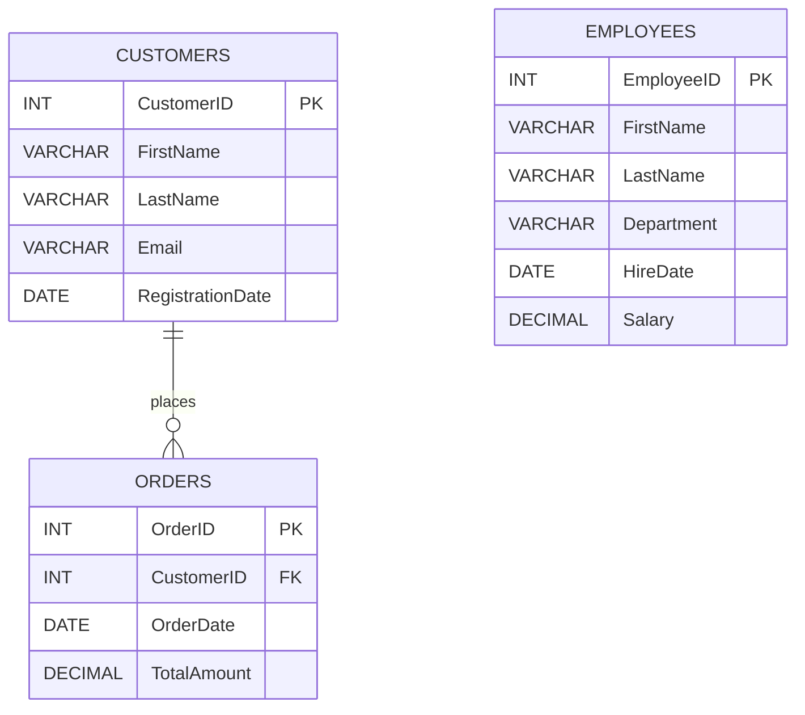

# 🔄 Data Transformer

<p align="center">
  <strong>Advanced SQL Analytics & Relational Database Project</strong><br>
  MySQL • SQL • phpMyAdmin • XAMPP
</p>

<p align="center">
  
  
  
  
  
</p>

---

## 📌 About the Project

**Data Transformer** is an advanced SQL project created to demonstrate practical relational database operations and analytical SQL techniques using **MySQL and phpMyAdmin**.

The project is built around three core entities:

- 👤 **Customers** — customer master information
- 🛒 **Orders** — customer order and transaction information
- 👨‍💼 **Employees** — employee and salary information

The project implements **17 analytical SQL tasks** covering relational joins, subqueries, date functions, string functions, window functions, ranking, running totals, and conditional business logic.

---

## 🎯 Project Objectives

- Create and manage relational database tables.
- Define **Primary Key** and **Foreign Key** constraints.
- Perform different SQL **JOIN** operations.
- Use subqueries with aggregate functions.
- Transform and format date values.
- Clean and manipulate string data.
- Use window functions for analytical calculations.
- Calculate running totals and rankings.
- Apply business rules using `CASE` expressions.
- Execute and verify SQL queries using phpMyAdmin.

---

## 🗄️ Database Architecture



### 🔗 Table Relationships

| Table | Primary Key | Foreign Key | Purpose |
|---|---|---|---|
| `Customers` | `CustomerID` | — | Customer information |
| `Orders` | `OrderID` | `CustomerID → Customers.CustomerID` | Customer transactions |
| `Employees` | `EmployeeID` | — | Employee and salary information |

---

# 🧠 SQL Concepts Covered

### 1. Relational JOINs

| Query | Concept | Purpose |
|---|---|---|
| 1 | `INNER JOIN` | Matching customer and order records |
| 2 | `LEFT JOIN` | All customers with orders where available |
| 3 | `RIGHT JOIN` | All order records with customer details |
| 4 | `FULL OUTER JOIN` using `UNION` | Unified customer and order records |

### 2. Subqueries

| Query | Concept | Purpose |
|---|---|---|
| 5 | Subquery + `AVG()` | Customers with above-average orders |
| 6 | Subquery + `AVG()` | Employees with above-average salary |

### 3. Date & Time Functions

`YEAR()` • `MONTH()` • `MONTHNAME()` • `DATEDIFF()` • `CURRENT_DATE()` • `DATE_FORMAT()`

| Query | Operation |
|---|---|
| 7 | Extract year, month number, and month name |
| 8 | Calculate date difference |
| 9 | Format order dates |

### 4. String Functions

`CONCAT()` • `REPLACE()` • `UPPER()` • `LOWER()` • `TRIM()`

| Query | Operation |
|---|---|
| 10 | Create customer full name |
| 11 | Replace part of a name |
| 12 | Convert text case |
| 13 | Remove extra email spaces |

### 5. Window Functions

**Query 14 — Running Total**

```sql
SUM(TotalAmount) OVER (ORDER BY OrderDate, OrderID)
```

**Query 15 — Ranking**

```sql
RANK() OVER (ORDER BY TotalAmount DESC)
```

### 6. CASE Expressions

**Query 16 — Order Discount**

```text
Amount > 1000  → 10% off
Amount > 500   → 5% off
Otherwise      → No Discount
```

**Query 17 — Salary Category**

```text
Salary >= 70000  → High
45000–69999      → Medium
Below 45000      → Low
```

---

# 📋 Complete Query Coverage

| # | SQL Task | Main Concept |
|---:|---|---|
| 01 | Retrieve orders with customer details | `INNER JOIN` |
| 02 | Retrieve all customers and their orders | `LEFT JOIN` |
| 03 | Retrieve all orders and customers | `RIGHT JOIN` |
| 04 | Retrieve all customers and orders | `UNION` + JOIN |
| 05 | Customers with above-average orders | Subquery + `AVG()` |
| 06 | Employees with above-average salary | Subquery + `AVG()` |
| 07 | Extract year and month | Date Functions |
| 08 | Calculate date difference | `DATEDIFF()` |
| 09 | Format order date | `DATE_FORMAT()` |
| 10 | Create customer full name | `CONCAT()` |
| 11 | Replace part of a name | `REPLACE()` |
| 12 | Change text case | `UPPER()` / `LOWER()` |
| 13 | Remove extra email spaces | `TRIM()` |
| 14 | Calculate running total | `SUM() OVER()` |
| 15 | Rank orders by amount | `RANK() OVER()` |
| 16 | Apply order discounts | `CASE` |
| 17 | Categorize employee salaries | `CASE` |

---

# 📊 Sample Dataset

### Customers

| CustomerID | Name | Registration Date |
|---:|---|---|
| 1 | John Doe | 2022-03-15 |
| 2 | Jane Smith | 2021-11-02 |
| 3 | Alice Brown | 2023-01-10 |

### Orders

| OrderID | CustomerID | Order Date | Total Amount |
|---:|---:|---|---:|
| 101 | 1 | 2023-07-01 | 150.50 |
| 102 | 2 | 2023-07-03 | 200.75 |
| 103 | 1 | 2023-07-15 | 1200.00 |
| 104 | 2 | 2023-08-01 | 650.00 |

### Employees

| EmployeeID | Name | Department | Salary |
|---:|---|---|---:|
| 1 | Mark Johnson | Sales | 50000.00 |
| 2 | Susan Lee | HR | 55000.00 |
| 3 | David Miller | IT | 85000.00 |
| 4 | Emily Clark | Sales | 30000.00 |

---

# 🛠️ Technology Stack

| Technology | Usage |
|---|---|
| **MySQL** | Relational database |
| **SQL** | Query language |
| **phpMyAdmin** | Database management and query execution |
| **XAMPP** | Local server environment |
| **Microsoft Word** | Project documentation |

---

# 🚀 How to Run

### 1️⃣ Start XAMPP

Open XAMPP Control Panel and start **Apache** and **MySQL**.

### 2️⃣ Open phpMyAdmin

```text
http://localhost/phpmyadmin/
```

### 3️⃣ Create the Database

Create a database for the project.

### 4️⃣ Create the Tables

Create:

```text
Customers
Orders
Employees
```

The `Orders.CustomerID` column references `Customers.CustomerID` through a foreign key.

### 5️⃣ Insert the Sample Data

Insert the customer, order, and employee records shown in this project.

### 6️⃣ Execute the Queries

Run **Query 1 through Query 17** in phpMyAdmin and verify the output.

---

# 📸 Execution Evidence

The repository contains screenshots for the table structures, inserted values, and results of all 17 SQL queries.

### Table Screenshots

`CustomerTable.png` • `CustomerValues.png` • `EmployeeTable.png` • `EmployeeValues.png` • `OrderTable.png` • `OrderValues.png`

### Query Screenshots

`Query1.png` through `Query17.png`

These screenshots provide visual evidence of SQL query execution in phpMyAdmin.

---

# 📄 Project Documentation

| File | Description |
|---|---|
| `Data-Transformer.docx` | Detailed academic project report |
| `Data-Transformer.pdf` | PDF version of the project documentation |
| `Data-Transformer.mp4` | Project demonstration video |

The documentation contains the database setup, SQL implementation, and execution results for the project tasks.

---

# 📁 Repository Structure

```text
Data-Transformer/
│
├── README.md
├── Data-Transformer.docx
├── Data-Transformer.pdf
├── Data-Transformer.mp4
│
├── CustomerTable.png
├── CustomerValues.png
├── EmployeeTable.png
├── EmployeeValues.png
├── OrderTable.png
├── OrderValues.png
│
├── Query1.png
├── Query2.png
├── Query3.png
├── Query4.png
├── Query5.png
├── Query6.png
├── Query7.png
├── Query8.png
├── Query9.png
├── Query10.png
├── Query11.png
├── Query12.png
├── Query13.png
├── Query14.png
├── Query15.png
├── Query16.png
└── Query17.png
```

---

# 📈 Project Outcomes

The project demonstrates practical skills in:

- Relational database design
- Primary and foreign keys
- Multi-table JOIN operations
- Aggregate functions and subqueries
- Date and time transformations
- String manipulation and data cleaning
- Window functions
- Running totals
- Ranking
- Conditional business logic
- SQL result verification using phpMyAdmin

---

# 👩‍💻 Author

**Priyal Patel**  
**Course:** SQL & Advanced Relational Database Management System (RDBMS)  
**GitHub:** [@priyal-24](https://github.com/priyal-24)  
**Repository:** [Data-Transformer](https://github.com/priyal-24/Data-Transformer)

---

# ✅ Project Status

<p align="center">
  <strong>COMPLETED — 17 / 17 SQL TASKS</strong>
</p>

The **Data Transformer** project demonstrates relational SQL querying, data transformation, analytical functions, and conditional business logic using MySQL and phpMyAdmin.

---

<p align="center">
  <i>Data Transformer • Advanced SQL Query Implementation</i>
</p>
